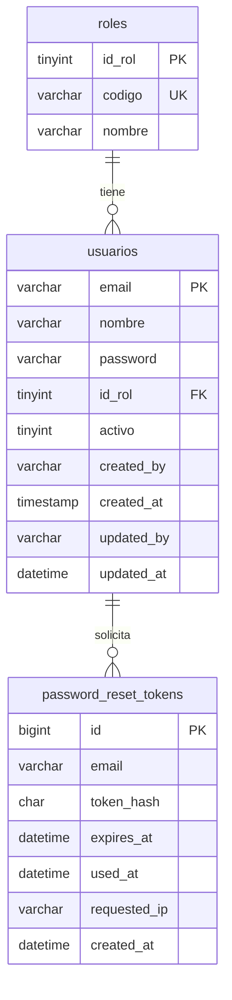
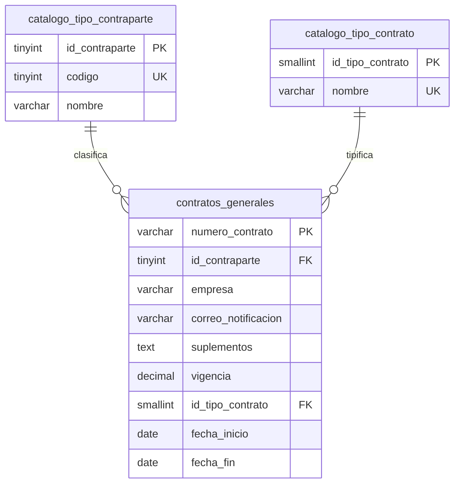
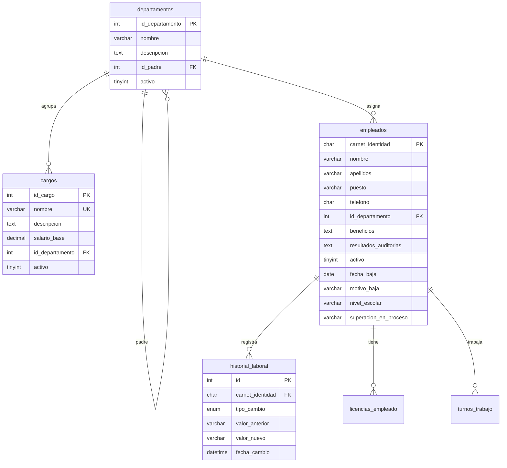
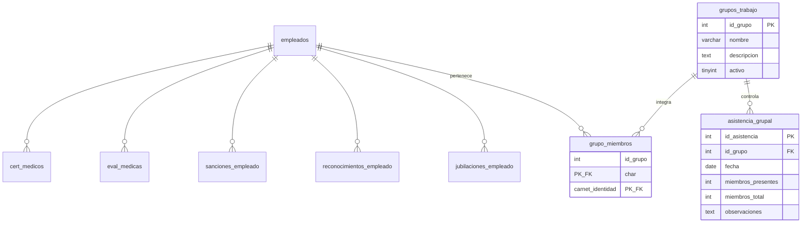
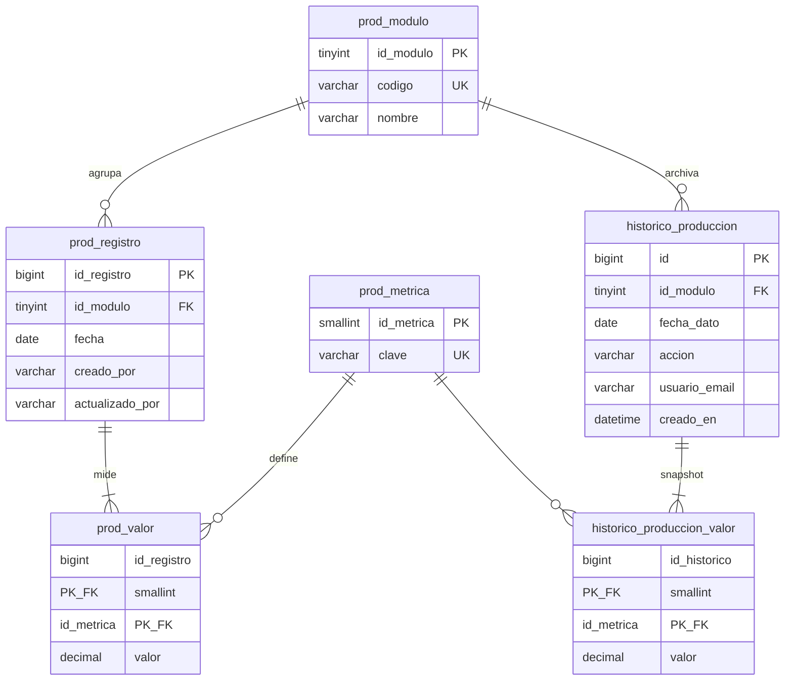

# Modelo Entidad-Relación — Base de datos `bd_crud` (normalizada)

Documento para tribunal de tesis. Corresponde al script `bd_crud_normalizada.sql`.

---

## 1. Confirmación: ¿está normalizada al 100 %?

**Sí, en el sentido académico estricto para los datos que se persisten en disco.**

| Criterio | Estado en `bd_crud` |
|----------|---------------------|
| **1FN** | Cada celda es atómica; no hay grupos repetitivos (p. ej. 3 accidentes en una fila → tabla `segseguridad_incidencia`). |
| **2FN** | No hay dependencias parciales: toda clave ajena depende de la clave primaria completa (`prod_valor`: PK compuesta `id_registro` + `id_metrica`). |
| **3FN** | No hay dependencias transitivas: `usuarios` → `roles`; `contratos` → catálogos; `empleados` → `departamentos`; producción descompuesta en registro + métrica + valor. |
| **BCNF** | Catálogos (`roles`, `catalogo_tipo_contrato`, `prod_metrica`, etc.) con determinante = clave candidata. |

### Datos que **no** se guardan (derivados — refuerza la normalización)

Estos valores existen solo en la **capa de aplicación** al consultar, no como columnas redundantes:

- Totales de producción (`total1_*`, `total2_*`, `total_*` en leche, etc.).
- Campo `vencido` en contratos (se calcula con `fecha_fin` vs fecha actual).

### Excepciones menores (mencionar en defensa oral si preguntan)

| Punto | Justificación |
|-------|----------------|
| `password_reset_tokens.email` sin FK a `usuarios` | Tabla técnica de sesión; el email puede existir antes de alta; no introduce redundancia de dominio de negocio. |
| `prod_registro.creado_por` / `actualizado_por` como texto (email) | Auditoría; FK opcional a `usuarios` posible en versión futura. |
| `historico_produccion.usuario_email` | Igual: trazabilidad sin duplicar perfil de usuario. |

### Eliminado respecto al diseño anterior

- Tabla ancha `sacrificio_vacuno`, `matadero_vivo`, `leche` (cientos de columnas).
- JSON `produccion_historico.datos_json`.
- `tabla1` (prueba).
- Columnas duplicadas en `empleados` (`cursos_disponibles`, `certificados`, `licencias` en texto).
- `cargos.departamento` como texto libre (ahora `id_departamento` FK).
- `contratos_generales.vencido` y `tipo_contrato` / `proveedor_cliente` sin catálogo.

**Conclusión para el tutor:** el **esquema físico** en MySQL está normalizado; la **presentación** al usuario (formularios anchos de producción) se mantiene vía backend que ensambla la misma forma de datos que antes.

---

## 2. Resumen del modelo

- **34 tablas** (sin `tabla1`).
- **Clave de negocio principal RRHH:** `empleados.carnet_identidad` (CHAR(11)).
- **Producción:** patrón **registro diario + métricas en filas** (modelo relacional universal).
- **Integridad referencial:** FOREIGN KEY en relaciones críticas.

---

## 3. Diagramas Entidad-Relación (notación Crow’s Foot / Mermaid)

### 3.1 Seguridad y usuarios



### 3.2 Contratación



*Atributo derivado (no en BD): `vencido` = f(`fecha_fin`).*

### 3.3 Recursos humanos — núcleo



### 3.4 Recursos humanos — relación 1:1 por empleado (antes `id_tabla`)

Cada tabla tiene **UNIQUE(carnet_identidad)** → una fila por empleado; PK sustituta `id_*`.

```mermaid
erDiagram
    empleados ||--o| asistencias : ""
    empleados ||--o| certificaciones : ""
    empleados ||--o| cursos : ""
    empleados ||--o| evalcapacitacion : ""
    empleados ||--o| evaluaciones : ""
    empleados ||--o| objetivos : ""
    empleados ||--o| salarios : ""
    empleados ||--o| seguridad : ""
    empleados ||--o| vacaciones : ""
    empleados ||--o| segseguridad : ""
    segseguridad ||--|{ segseguridad_incidencia : "detalla"

    asistencias {
        int id_asistencia PK
        char carnet_identidad FK_UK
        varchar codigo_asistencia
        text desc_causas
        decimal horas_trabajadas
    }
    segseguridad {
        int id_seg PK
        char carnet_identidad FK_UK
    }
    segseguridad_incidencia {
        int id_incidencia PK
        int id_seg FK
        tinyint orden
        int cantidad
        varchar descripcion
    }
```

*(Misma estructura lógica: `certificaciones`, `cursos`, `evalcapacitacion`, `evaluaciones`, `objetivos`, `salarios`, `seguridad`, `vacaciones` → FK `carnet_identidad` + PK propia.)*

### 3.5 RRHH — relación 1:N y grupos



### 3.6 Producción (normalización de tablas anchas)



**Cardinalidad lógica:** un `prod_registro` = un día + un módulo (sacrificio | matadero | leche). Muchas métricas por registro vía `prod_valor`.

**Métricas no almacenadas:** claves cuyo prefijo es `total1`, `total2`, `total3`… (se calculan al leer).

---

## 4. Diccionario de entidades (lista para memoria)

| Entidad | Descripción |
|---------|-------------|
| `roles` | Catálogo de perfiles del sistema (admin, rrhh, …). |
| `usuarios` | Cuentas de acceso; dependen de `roles`. |
| `password_reset_tokens` | Tokens temporales de recuperación de contraseña. |
| `catalogo_tipo_contraparte` | Cliente vs proveedor (dominio de contratos). |
| `catalogo_tipo_contrato` | Tipos de contrato (Compra, Servicio, …). |
| `contratos_generales` | Contrato identificado por `numero_contrato`. |
| `departamentos` | Estructura organizativa (jerárquica con `id_padre`). |
| `cargos` | Puestos tipo con salario base y departamento. |
| `empleados` | Persona trabajadora; eje de RRHH. |
| `historial_laboral` | Cambios de puesto, departamento o salario. |
| `licencias_empleado` | Licencias registradas. |
| `asistencias` … `vacaciones` | Módulos 1:1 por carnet (ver diagrama 3.4). |
| `segseguridad` + `segseguridad_incidencia` | Seguridad industrial descompuesta en incidencias. |
| `turnos_trabajo` | Turnos (N por empleado). |
| `grupos_trabajo` + `grupo_miembros` | Grupos y membresía N:M. |
| `asistencia_grupal` | Control de asistencia por grupo y fecha. |
| `cert_medicos`, `eval_medicas` | Salud ocupacional. |
| `sanciones_empleado`, `reconocimientos_empleado`, `jubilaciones_empleado` | Gestión disciplinar y salidas. |
| `prod_modulo` | Sacrificio, matadero, leche. |
| `prod_metrica` | Catálogo de indicadores (clave única). |
| `prod_registro` | Hecho de producción por fecha y módulo. |
| `prod_valor` | Valor numérico de una métrica en un registro. |
| `historico_produccion` | Evento de auditoría (actualización/eliminación). |
| `historico_produccion_valor` | Valores archivados del evento (normalizado). |

---

## 5. Cómo visualizar los diagramas

1. **VS Code / Cursor:** extensión “Markdown Preview Mermaid Support” y abrir este archivo.
2. **Online:** [https://mermaid.live](https://mermaid.live) — pegar cada bloque `mermaid`.
3. **MySQL Workbench:** Database → Reverse Engineer desde `bd_crud` ya importada (diagrama físico automático).
4. **draw.io:** Importar desde MER o dibujar siguiendo las secciones 3.1–3.6.

Archivo adicional solo Mermaid: `MODELO_BD_MERMAID.mmd`.

---

## 6. Comparativa rápida (antes → después)

| Antes | Después |
|-------|---------|
| ~30 tablas, muchas sin FK | 34 tablas con FK declaradas |
| Producción: 1 fila ≈ 150+ columnas | 1 fila cabecera + N filas en `prod_valor` |
| Histórico: 1 columna JSON | Cabecera + detalle relacional |
| `usuarios.rol` ENUM repetido | `roles` + `id_rol` |
| `id_tabla` = carnet mal nombrado | `carnet_identidad` FK explícita |

---

*Generado para proyecto CRUD unificado — base `bd_crud` normalizada.*
